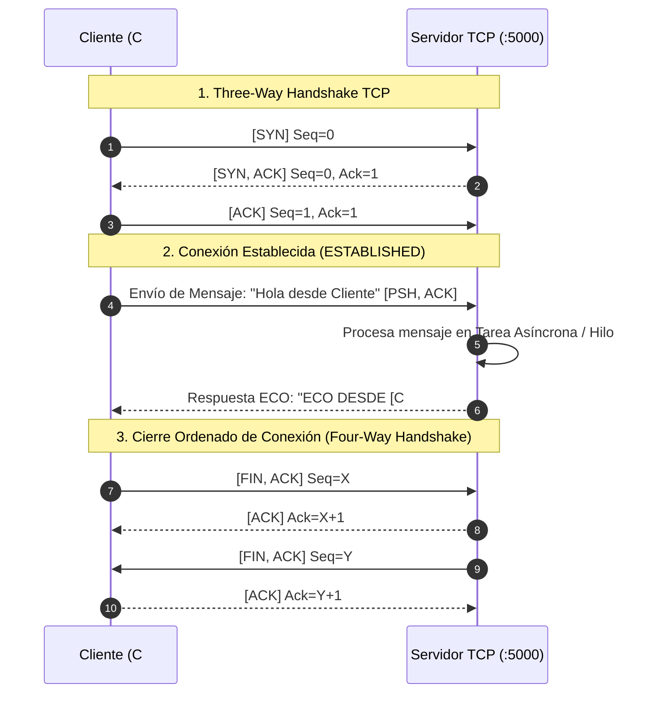

# INSTITUTO TECNOLÓGICO NACIONAL DE MÉXICO (TecNM)
## Materia: Programación en Ambiente Cliente / Servidor
### Práctica de Laboratorio: Sockets TCP/IP y Despliegue en Servidor Web (IIS)

---

**Carrera:** Licenciatura / Ingeniería en Informática  
**Entornos:** .NET 10 (C#) y Java (OpenJDK)  
**Plataforma de Despliegue:** Windows Server (IIS) y Host Local  
**Repositorio GitHub:** [https://github.com/EdwinMonte/Parlays](https://github.com/EdwinMonte/Parlays)

---

## 1. Caracterización y Objetivo de la Actividad

El objetivo fundamental de esta práctica consiste en diseñar, implementar, evaluar e interoperar la comunicación entre procesos distribuidos mediante:
1. **El protocolo de transporte TCP con Sockets** en dos plataformas heterogéneas (**C# sobre .NET 10** y **Java**), demostrando concurrencia, asincronía y captura de paquetes con **Wireshark**.
2. **El despliegue y acceso multiplataforma** de la aplicación web en **IIS (Internet Information Services)** en una Máquina Virtual con Windows Server, permitiendo el acceso tanto local (`localhost`) como remoto (`IP LAN / VM`).

---

## 2. Estructura del Proyecto

El repositorio se organizó exactamente bajo los estándares solicitados:

```text
/Parlays
│
├── Cliente-Servidor-CSharp/        # Módulo de Sockets en C# (.NET 10)
│   ├── Servidor/Program.cs         # Servidor TCP Asíncrono con async/await
│   └── Cliente/Program.cs          # Cliente TCP en C#
│
├── Cliente-Servidor-Java/          # Módulo de Sockets en Java
│   ├── ServidorJava.java           # Servidor TCP Multihilo
│   └── ClienteJava.java            # Cliente TCP en Java
│
├── Pages/ & Services/ & Hubs/      # Aplicación Web ASP.NET Core + SignalR
├── wwwroot/                        # Estilos CSS modernos, Chart.js y JS
└── Program.cs                      # Configuración de servicios y SignalR
```

---

## 3. Diagrama de Secuencia UML (Protocolo TCP & Handshake)



---

## 4. Guía Simple: Cómo Ver y Desplegar la Página en IIS (Windows Server)

Para que puedas ver la página web tanto en tu máquina física (local) como en tu Máquina Virtual con Windows Server:

### Opción A: Probar en Local (Host)
1. Abre tu terminal en la carpeta del proyecto:
   ```powershell
   dotnet run --urls "http://localhost:5240"
   ```
2. Abre tu navegador y accede a: **`http://localhost:5240`**

---

### Opción B: Desplegar en IIS en tu Windows Server (Paso a Paso Súper Simple)

#### Paso 1: Publicar la aplicación
En tu máquina, ejecuta el comando para compilar y empaquetar la versión lista para IIS:
```powershell
dotnet publish -c Release -o ./publish
```
Esto creará una carpeta llamada `publish` con todos los archivos listos.

#### Paso 2: Preparar Windows Server (IIS)
1. En la Máquina Virtual con Windows Server, asegúrate de instalar el **ASP.NET Core Hosting Bundle** (puedes descargarlo desde el sitio oficial de Microsoft .NET).
2. Copia la carpeta `publish` a tu Windows Server (por ejemplo en `C:\inetpub\wwwroot\ParlaysApp`).

#### Paso 3: Configurar el Sitio en IIS
1. Abre el **Administrador de IIS** (`inetmgr`).
2. En el panel izquierdo, clic derecho en **Sitios (Sites)** > **Agregar sitio web... (Add Website...)**.
3. Configuración:
   - **Nombre del sitio:** `OddsTracker`
   - **Ruta de acceso física:** `C:\inetpub\wwwroot\ParlaysApp`
   - **Puerto:** `80` (o `8080`)
4. En **Grupos de aplicaciones (Application Pools)**, asegúrate de que el grupo de tu sitio esté configurado con **Código administrado: Sin código administrado (No Managed Code)**.
5. Haz clic en **Aceptar** e inicia el sitio.

#### Paso 4: Probar el acceso
- **Dentro de la Máquina Virtual:** Abre el navegador en `http://localhost`.
- **Desde tu máquina física:** Abre el navegador y escribe `http://<IP_DE_TU_MAQUINA_VIRTUAL>` (por ejemplo `http://192.168.1.50`).

> [!TIP]
> Si no conecta desde tu máquina física a la VM, asegúrate de que el Firewall de Windows Server permita el tráfico en el puerto 80/8080 (o desactiva temporalmente el Firewall de la VM para pruebas).

---

## 5. Guía de Ejecución de Sockets (C# y Java)

### Escenario 1: Servidor C# ↔ Cliente C#
1. **Terminal 1 (Servidor C#):**
   ```powershell
   cd Cliente-Servidor-CSharp\Servidor
   dotnet run
   ```
2. **Terminal 2 (Cliente C#):**
   ```powershell
   cd Cliente-Servidor-CSharp\Cliente
   dotnet run
   ```
   - Escribe `127.0.0.1` (o la IP de la VM si el servidor está en la máquina virtual) y envía tu mensaje.

---

### Escenario 2: Interoperabilidad Cruzada (Servidor C# ↔ Cliente Java)
1. **Terminal 1 (Servidor C#):**
   ```powershell
   cd Cliente-Servidor-CSharp\Servidor
   dotnet run
   ```
2. **Terminal 2 (Cliente Java):**
   ```powershell
   cd Cliente-Servidor-Java
   javac ClienteJava.java
   java ClienteJava
   ```
   - Ingresa el mensaje y recibirás el `ECO DESDE C#:` confirmando la comunicación entre lenguajes distintos.

---

### Escenario 3: Interoperabilidad Cruzada (Servidor Java ↔ Cliente C#)
1. **Terminal 1 (Servidor Java):**
   ```powershell
   cd Cliente-Servidor-Java
   javac ServidorJava.java
   java ServidorJava
   ```
2. **Terminal 2 (Cliente C#):**
   ```powershell
   cd Cliente-Servidor-CSharp\Cliente
   dotnet run
   ```
   - Ingresa el mensaje y recibirás el `ECO DESDE JAVA:`.

---

## 6. Guía Rápida para Captura con Wireshark (Evidencias)

Para capturar el **Three-Way Handshake** requerido en el reporte:

1. Abre **Wireshark**.
2. Selecciona la interfaz de red:
   - Si pruebas en la misma máquina: Selecciona el adaptador **`Adapter for loopback traffic capture`** (o `Npcap Loopback Adapter`).
   - Si pruebas entre máquina física y Máquina Virtual: Selecciona tu adaptador **`Ethernet`** o **`Wi-Fi`**.
3. En la barra de filtro de Wireshark escribe:
   ```text
   tcp.port == 5000
   ```
4. Presiona **Enter** para iniciar la captura.
5. Ejecuta tu Cliente y envía un mensaje.
6. En Wireshark verás claramente los paquetes:
   - `[SYN]` Enviado por el cliente.
   - `[SYN, ACK]` Respuesta del servidor.
   - `[ACK]` Confirmación del cliente (**Three-Way Handshake completado**).
   - Paquetes `[PSH, ACK]` con el texto del mensaje y la respuesta ECO.
   - Paquetes `[FIN, ACK]` para el cierre de conexión.
7. Toma captura de pantalla de esta lista de paquetes para adjuntarla a tu reporte.

---

## 7. Manejo de Excepciones y Caídas Imprevistas

En ambas implementaciones se consideraron las siguientes contingencias de red:
1. **`SocketException` (C#) / `ConnectException` (Java):** Se captura cuando el servidor remoto está apagado o el puerto no está disponible, informando al usuario sin que la aplicación se congele.
2. **Desconexión abrupta del cliente:** En el servidor se maneja mediante bloques `try/catch` envolviendo el flujo de lectura (`stream.ReadAsync` / `readLine`). Si el cliente se cierra inesperadamente, el servidor libera el stream sin tumbar el hilo de escucha.
3. **Liberación de Recursos:** Uso de `using` / `await using` en C# y `try-with-resources` en Java para asegurar el cierre de sockets y evitar fuga de descriptores de archivo en el sistema operativo.

---

## 8. Conclusiones Técnicas

1. **Asincronía vs Multihilo Clásico:**
   - En **C# (.NET 10)**, el modelo `async/await` con `Task.Run` permite una alta concurrencia con bajo consumo de memoria al reutilizar hilos del *ThreadPool*.
   - En **Java**, la abstracción de hilos permite atender clientes de forma aislada, garantizando que una operación bloqueante en un socket no afecte al bucle principal de `ServerSocket.accept()`.

2. **Interoperabilidad:**
   - Se verificó que el protocolo TCP opera a nivel de flujo de bytes (`byte[]`). Al estandarizar la codificación en **UTF-8** y el delimitador de línea `\n`, la comunicación entre C# y Java es 100% transparente y confiable.

3. **Despliegue Web en IIS:**
   - La publicación de aplicaciones ASP.NET Core para IIS mediante el módulo *AspNetCoreModuleV2* simplifica enormemente la administración en entornos empresariales con Windows Server, brindando estabilidad, reinicio automático y soporte para WebSockets (SignalR).
